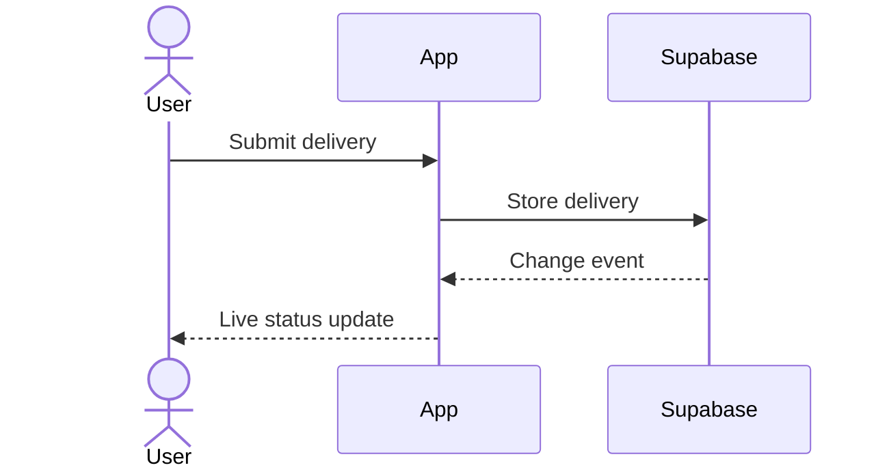

# Solution Architect

Turn all PRDs of one PROJ into one concise architecture document. Readers are
software developers: the engineer who approves it at Checkpoint 1 and the agents
that plan and implement from it (writing-plans, implementers).

## Rules

- **English only** in every written file, whatever language the user chats in.
- **No code** in the architecture and delta: no SQL, no TypeScript, no API
  snippets. WHAT and WHY, not HOW. Only `migration-design.md` may carry DDL.
- **Scope = architecturally significant only.** A decision belongs here when it
  affects multiple PRDs or waves, or is significant on its own: irreversible (a
  live-data migration), a security/trust boundary, or ownership of an external
  integration. Everything else — component trees, route names, field lists,
  validation shapes, folder and test layout — is left to the wave plan and the
  implementer. When in doubt, leave it out.
- **Stack is inherited.** `docs/ARCHITECTURE.md` § Stack (from `bootstrap` 0c or
  `intake` 0b) is the single source of truth: build on it, don't restate or
  re-open it. A new stack layer (queue, cache, second DB) or closing an `open` row
  is one Cross-Cutting Tech Decision plus a `Stack change:` line in the delta.
  Never edit `docs/` here — P7 (`documentation`) promotes built changes.
- **Decomposed PROJs:** sibling PROJs are external dependencies or consumers.
  Document only the contract (ownership, dependency direction, shared entities,
  rollout assumptions), never their internals.
- **Don't touch PRDs.** Tech design lives in its own file.
- **Reconcile, don't narrate.** When review or the user changes a decision, rewrite
  the section as if it were right the first time — no "Correction (post-review)"
  or "an earlier draft said".

## Inputs

1. `specs/INDEX.md` if present.
2. `docs/ARCHITECTURE.md` (Stack + load-bearing architecture) and
   `docs/GUIDELINES.md` if present; list existing UI components and server/API
   entry points with `git ls-files` on the paths that stack implies.
3. `specs/PROJ-<X>-<theme>/1_concept/PROJ-<X>-concept.md`.
4. **All** PRDs in `specs/PROJ-<X>-<theme>/2_PRDs/` — find shared entities, auth,
   data flows, and which PRDs need a backend.
5. If present: `1d_prototypes/implementation-handoff.md` (resolve screens via its
   source/preview references, HTML files as fallback; component imports show UI
   reuse, not approved business logic) and `1c_design/design-language.md` — or the
   canonical shared design language of another PROJ if this one consumes it.
6. Approved concept/PRD/architecture of blocking sibling PROJs, as dependency
   context only.

Ask the user (`AskUserQuestion`) only about open cross-cutting questions, e.g.
accounts and roles, cross-device sync, third-party integrations, migration
rollback policy, or a UI handoff that conflicts with § Stack.

## Output 1: `specs/PROJ-<X>-<theme>/3-4_plan/PROJ-<X>-architecture.md`

```markdown
# PROJ-<X> Architecture — <theme>

## Overview
[2-3 sentences: what this PROJ builds and how it fits the existing system]

## PRDs Covered
- PROJ-<X>-PRD-1: <desc>

## System Boundaries
[Only if new/changed. Mermaid flowchart; mark new parts with `classDef new` + `:::new`.]

## Data Model
[One line per entity: owning PRDs, relationships. No fields, types, constraints,
indexes. Add an erDiagram (names + cardinality only) at 3+ related entities.]

## Key Flows
[0-3 sequenceDiagrams for flows that cross system boundaries or are significant
per Rules — auth, real-time, async work, external integrations, multi-system
writes. Each with "Affects: PRD-…". Omit the section if none.]

## Cross-Cutting Tech Decisions
[Numbered `### Decision N: <title>`, numbers stable through reconciliation
(writing-plans cites them). 3-6 sentences each: decision, its one real reason, affected PRDs. Cite
requirements by ID ("per PRD-2 US-2 AC-9"), don't quote them.]

## UI Implementation Constraints
[Only with a UI handoff: project mode (greenfield/brownfield/hybrid), component
families to preserve, shared new-component candidates, interaction containers
that must stay consistent, design-token constraints. No component tree. Framework,
styling, component library come from § Stack; design system from frontend-design.
If the handoff conflicts with § Stack, § Stack wins — raise it as an open question.]

## Cross-PROJ Dependencies
[Only if decomposed: siblings consumed/blocking, contract, out of scope]

## Dependencies
[New packages only, with affected PRDs]
```

Example decision: "Real-time updates via Supabase subscriptions, not polling —
users need instant feedback. Affects: PRD-2, PRD-3."

Example flow:



**Diagrams:** valid Mermaid, ~12 nodes max, one-sentence caption each, derived from
the inputs — never invented. Participants are systems or major components;
messages are intents, not routes, SQL, or method names; `alt`/`opt` only where
observable behavior differs. Diagrams illustrate decisions, they don't replace the WHY.

**Migration escape valve:** if a live-data migration decision can only be verified
with DDL-level detail (uniqueness scope, triggers, validation queries, rollback),
put that detail in `3-4_plan/PROJ-<X>-migration-design.md`, organized by decision.
The architecture names the decision and WHY in plain language and points there
("detailed in `PROJ-<X>-migration-design.md` § Decision 3").

## Output 2: `specs/PROJ-<X>-<theme>/architecture-delta.md` (always)

Implementer context bundles (compiled by the P0 setup subskill) prefer this file and block the
role outright if the bundle exceeds its ~6.5k-token budget. Write it every time.

```markdown
# PROJ-<X> Architecture Delta

Condensed decision summary for implementer context bundles. Full rationale and
detail: `3-4_plan/PROJ-<X>-architecture.md`.

## Scope
[2-4 sentences]

## Stack changes
- [Only if any: `Stack change: <layer> — <choice> (<why>)`]

## Data model decisions
- [One line per decision: WHAT + short parenthetical WHY]

## [Other decision groupings as needed]
- [Same format]
```

Compression drops wording, never decisions: every Cross-Cutting Tech Decision,
binding UI constraint, and cross-PROJ contract keeps at least one line; migration
decisions keep their pointer. Every line traces to the full document. No diagrams.
Stay well under 1500 tokens. No wave section — `writing-plans` appends it.

## Cross-Review (automatic, same turn)

Right after saving, without asking:

```bash
bash scripts/cross-review.sh architecture <X> <theme> \
  --artifacts specs/PROJ-<X>-<theme>/3-4_plan/PROJ-<X>-architecture.md \
    specs/PROJ-<X>-<theme>/architecture-delta.md \
    specs/PROJ-<X>-<theme>/3-4_plan/PROJ-<X>-migration-design.md \
  --ground-truth specs/PROJ-<X>-<theme>/1_concept/PROJ-<X>-concept.md \
    specs/PROJ-<X>-<theme>/2_PRDs/*.md docs/ARCHITECTURE.md docs/GUIDELINES.md \
    specs/PROJ-<X>-<theme>/1d_prototypes/implementation-handoff.md \
    <design-language file read as input 5, local or shared> \
    <sibling PROJ files read as input 6> \
  --author-provider <current-writer> --persist --round 1
```

- Drop paths that don't exist (the script fails on missing files); never drop a
  PRD. If the context cap rejects the call, tell the user which inputs you left out.
- `--persist` is mandatory: CP1's fast path reads the persisted round and ledger.
- Reconcile and re-review through round 3 while any findings remain; keep the
  delta aligned. Further rounds only on user request.

## Continue into writing-plans

Summarize decisions, cross-review result, and open questions, then invoke
**writing-plans** (4) in the same session — approval happens at Checkpoint 1 (run by Step 5, executing-large-model).
Stop instead only if Critical/High findings remain after round 3, the review
failed to run (exit `1` is not a round), a product decision is open, or the user
asked to review the architecture alone first.

Update `specs/INDEX.md` status to "In Progress" if it exists. Say once:

> "Architecture is ready at `specs/PROJ-<X>-<theme>/3-4_plan/PROJ-<X>-architecture.md`, with a condensed `architecture-delta.md` for implementer context bundles. Cross-review: <clean | N findings reconciled>. Continuing into **writing-plans**; you approve architecture and plans together at Checkpoint 1."

Commit: `docs(PROJ-<X>): Add architecture for <theme>`

## Legacy Folder Layout

PROJ folders created before the layout rename use different subfolder
names. Mapping, old → current:

`2_visual-companion/` → `1b_visual-companion/` · `4_design/` → `1c_design/` ·
`5_mockups/`, `1d_mockups/` → `1d_prototypes/` · `3_PRDs/` → `2_PRDs/` ·
`8_handoff/` → `2b_handoff/` · `6_plan/` → `3-4_plan/` ·
`7_progress/` → `5_progress/`

If an expected folder is missing but its legacy twin exists, **read from the
legacy one and keep writing where the existing files already are**. Never
create a second folder next to it — a split PROJ is worse than an old name.
Say it once, then continue either way:

> "This PROJ uses the old folder layout (`<old>`). Rename the folders to the
> current names, or continue with the existing layout?"

Renaming is a `git mv` per folder plus a search for the old paths in the
PROJ's own documents. It is never a precondition for this skill.
