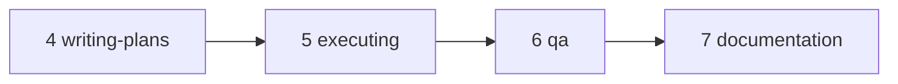
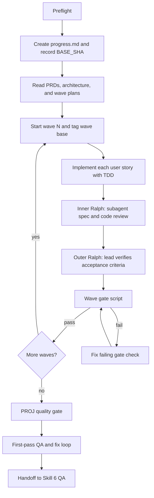
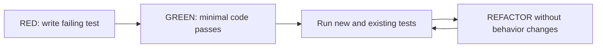

# Executing Skill

**Last updated:** 2026-06-16

The executing skill is Step 5 in the 0-to-7 chain. It turns the wave plans from Step 4 into working code, one PROJ at a time, with deterministic verification after each user story and hard gates between waves.

Its main job is orchestration. The lead agent keeps the process moving, records proof in `progress.md`, dispatches implementation or fix work when useful, and personally owns acceptance-criteria verification and browser checks that require the main tool context.

## Where It Fits



Inputs:

- PRDs in `specs/PROJ-<X>-<theme>/3_PRDs/*.md`
- Architecture in `specs/PROJ-<X>-<theme>/6_plan/PROJ-<X>-architecture.md`
- Wave plans in `specs/PROJ-<X>-<theme>/6_plan/PROJ-<X>-wave-<N>-plan.md`
- Gate config in `specs/PROJ-<X>-<theme>/6_plan/wave-gate-config.json`
- UI handoff in `specs/PROJ-<X>-<theme>/5_mockups/implementation-handoff.md`, when the PROJ has UI work

Outputs:

- Implemented and committed code
- `specs/PROJ-<X>-<theme>/7_progress/PROJ-<X>-progress.md`
- Optional source-local `agent.md` notes for non-obvious gotchas
- A QA-ready PROJ handoff to Step 6

## Core Lifecycle



The loop is intentionally continuous. A green wave gate is the signal to start the next wave; the lead does not stop for user confirmation between waves unless there is a blocker.

## Preflight

Before implementation starts, the skill checks the project environment because later gates depend on specific tools and config.

Required setup includes:

- CodeRabbit config at `.coderabbit.yaml` or `.coderabbit.yml`, with focused path filters.
- Supabase CLI or equivalent Supabase tooling when the project uses Supabase.
- Playwright MCP when planned frontend routes require full QA later.
- `agent-browser`, `coderabbit`, and `jq` CLIs for wave gates.
- `BASE_SHA`, recorded with `git rev-parse HEAD`.
- `7_progress/PROJ-<X>-progress.md`, created before implementation changes.

`progress.md` is the short-term memory and proof log for the whole PROJ. If it is missing, execution stops and creates it before continuing.

## Memory Files

### `progress.md`

`progress.md` tracks the active wave, user-story task status, tests, acceptance-criteria verification, Ralph loop iterations, gate results, QA results, and blockers.

It is updated after every meaningful action:

- After each TDD task cycle.
- After each inner or outer Ralph iteration.
- After wave gates.
- After quality-gate checks.
- Whenever a blocker appears.

The most important proof blocks are the wave gate blocks:

```markdown
### Wave N Gate - PASSED
```

Those blocks are appended by `scripts/wave-gate.sh`. Manual checklist edits are not enough to prove a wave is complete.

### `agent.md`

`agent.md` is long-term developer memory for non-obvious project gotchas. It lives near the feature source, such as `src/features/<feature>/agent.md`.

Use it sparingly. Good entries describe project-wide behavior that future implementers would otherwise rediscover, such as framework quirks, tooling traps, or dead ends.

## Wave Execution

Each PROJ is split into numbered waves by Step 4. Each wave contains one or more user stories.

Before a wave starts:

1. Read relevant `agent.md` notes.
2. Verify the previous wave has a passed gate block, if this is not wave 1.
3. Tag the current HEAD as the wave base:

```bash
git tag "wave-${WAVE}-start-PROJ-${PROJ}"
```

The wave base tag scopes the CodeRabbit review inside the wave gate. Without the tag or `WAVE_BASE_SHA`, the gate fails.

For implementation, the skill chooses the implementer type by scope:

- UI-only user story -> frontend implementer.
- Server-only user story -> backend implementer.
- Full-stack user story -> generic implementer.

Parallel waves can run multiple independent user stories at once. In those cases, an integration guard monitors file ownership and overlap. Single-story waves do not need team overhead.

## TDD Task Loop

Each user-story implementation follows a task-level TDD loop:



Rules:

- No production code before a failing test.
- The failing test must fail for the expected reason, not because of import or setup errors.
- After the fix, run the relevant tests and existing regression tests.
- Refactors must not add behavior.
- The implementer must report actual commands and observed results.

## Inner Ralph Loop

After all tasks for a user story are implemented, the implementer runs an inner Ralph loop. This is a two-stage review inside the implementation worker's scope.

Stage 1: spec compliance

- Compare the actual code against the task requirements.
- Fix missing or incorrect behavior.
- Re-run tests.
- Repeat until clean.

Stage 2: code quality

- Review error handling, type safety, test quality, boundaries, and architecture.
- Fix confirmed issues.
- Re-run tests.
- Repeat until clean.

The implementer does not verify acceptance criteria. That is reserved for the lead agent's outer Ralph loop.

## Outer Ralph Loop

The outer Ralph loop is the lead agent's deterministic acceptance-criteria check after each user story reports back.

```text
while not all ACs pass and iteration < 3:
  for each AC:
    run the deterministic check
    if it fails:
      capture the exact failure output
      dispatch a fix with the failing AC and verbatim output
      update progress.md
  re-check all ACs
```

Rules:

- Use real commands or direct behavior verification.
- Do not use subjective review as proof.
- Pass failure output verbatim to the fix worker.
- Update `progress.md` after each iteration.
- Stop after 3 iterations on the same unresolved AC and document the full history.

If an AC still fails after 3 iterations, execution records the unresolved state and continues to the wave gate. The gate is still the hard proof before the next wave; it will fail if configured AC commands do not pass.

## Wave Gate

The wave gate is the hard boundary between waves.

```bash
bash scripts/wave-gate.sh <N> <PROJ-X> <theme>
```

The script validates:

- Every `ac_commands` entry for the wave exits 0.
- The configured `build_cmd` exits 0.
- CodeRabbit reports no non-advisory findings for the wave diff.
- `agent-browser` smoke tests pass for configured frontend routes.

If the script exits non-zero, execution stops at that gate, fixes the failure, and reruns the script. Only a passing script allows the next wave to start.

On success, the script appends the canonical passed block to `progress.md`.

## Build Policy

The skill avoids scattered build checks.

- Wave builds run inside `scripts/wave-gate.sh`.
- The assembled PROJ build runs inside the PROJ quality gate.

If a build fails, the fix gets the verbatim compiler output and the failing gate is rerun.

## CodeRabbit and Smoke Tests

CodeRabbit is mandatory per wave, but it is owned by the wave gate. The lead does not run a second separate per-wave CodeRabbit review.

Frontend smoke tests are also owned by the wave gate. They use `agent-browser` against configured routes to catch blank pages, visible errors, and broken primary happy paths before the next wave compounds the issue.

## PROJ Quality Gate

After all waves pass, the quality gate checks the assembled feature diff from `BASE_SHA` to `HEAD`.

It includes:

- Full code review of the feature diff.
- One PROJ-level build using `build_cmd`.
- Optional Sonar scan when both `sonar` and `sonar-scanner` are available and the project is configured.
- Test and lint verification.

Exit criteria:

- Zero remaining P0/P1 code-review findings.
- Full build passes.
- If Sonar ran, zero BLOCKER/CRITICAL/MAJOR issues in feature files.
- If Sonar was skipped, the skip reason is logged.
- Tests pass.
- No new lint errors.

The lead must verify findings before fixing them. Automated review output can be wrong, too broad, or outside scope. Confirmed P0/P1 and major Sonar issues are fixed; lower-severity issues are logged for user decision unless time and scope allow.

## First-Pass QA and Fix Loop

Skill 5 includes a first-pass QA loop before handing off to Skill 6.

The lead runs browser E2E checks directly because Playwright MCP tools require the main context. In parallel, delegated QA streams can run security and UI audits.

Fix policy:

- Critical and High bugs are fixed immediately.
- After each fix, rerun the specific check that found the bug.
- Re-run relevant QA checks for regression.
- Medium and Low bugs are presented to the user for release decision.
- If the same bug survives 3 fix attempts, escalate with the full history.

Skill 5 considers first-pass QA clean when there are no Critical or High bugs.

## Handoff to Skill 6

Skill 6 is still required. Skill 5's QA is a first-pass filter, not the comprehensive release gate.

Before handoff, the lead verifies that `progress.md` contains:

- Wave plan and Ralph iteration summaries.
- Wave gate proof blocks.
- Quality-gate code review, build, and Sonar results or explicit skip reason.
- First-pass QA results.

Skill 6 then runs the comprehensive QA panel, security review, simplicity review, PROJ retrospective, and `AGENTS.md` candidate collection. Skill 7 later uses those artifacts for documentation.

## Failure Handling

The executing skill follows a 3-fix rule:

- Reproduce the failure.
- Read the full error and stack trace.
- Form one hypothesis.
- Make the smallest fix.
- Re-run the failing check and relevant regressions.
- After 3 failed attempts on the same issue, stop and escalate with the exact history.

Escalate when:

- The same AC fails after 3 outer Ralph iterations.
- The root cause is a spec or architecture problem.
- A required dependency or external service is unavailable.
- Requirements are ambiguous or contradictory.

## What Makes the Skill Strict

The executing skill is strict because every transition has proof:

- TDD proves implementation tasks.
- Inner Ralph proves task-level spec and code review.
- Outer Ralph proves acceptance criteria.
- Wave gates prove a wave is safe to build on.
- The quality gate proves the assembled feature.
- First-pass QA proves there are no known Critical or High bugs before Skill 6.

That structure lets long implementation runs continue without repeatedly asking for permission while still leaving a durable audit trail for QA, documentation, and future agents.
