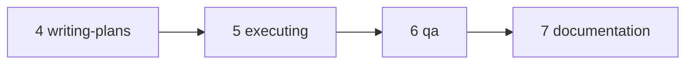
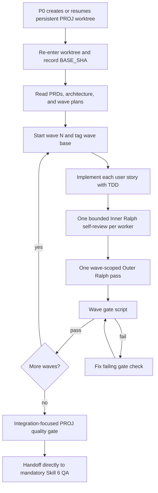
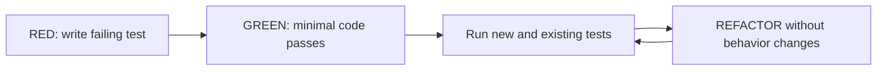

# Executing Skill

**Last updated:** 2026-08-28

The executing skill is Step 5 in the 0-to-8 chain. It turns the wave plans from Step 4 into working code, one PROJ at a time, with deterministic verification once per wave and hard gates between waves.

Its main job is orchestration. When delegation is available, workers own every code, test, and fix edit. The lead owns decomposition, dispatch, integration, deterministic verification, gates, commits, and operational records. Disjoint work runs concurrently; dependencies and overlapping ownership run serially. Local editing is only a visible fallback when delegation is unavailable or prohibited.

## Where It Fits


```mermaid
flowchart LR
  S4[4 writing-plans] --> S5[5 executing]
  S5 --> S6[6 qa]
  S6 --> S7[7 documentation]
```

Inputs:

- PRDs in `specs/PROJ-<X>-<theme>/2_PRDs/*.md`
- Architecture in `specs/PROJ-<X>-<theme>/3-4_plan/PROJ-<X>-architecture.md`
- Wave plans in `specs/PROJ-<X>-<theme>/3-4_plan/PROJ-<X>-wave-<N>-plan.md`
- Gate config in `specs/PROJ-<X>-<theme>/3-4_plan/wave-gate-config.json`
- UI handoff in `specs/PROJ-<X>-<theme>/1d_mockups/implementation-handoff.md`, when the PROJ has UI work

Outputs:

- Implemented and committed code
- `specs/PROJ-<X>-<theme>/5_progress/PROJ-<X>-progress.md`
- Optional source-local `agent.md` notes for non-obvious gotchas
- A QA-ready PROJ handoff to Step 6

## Core Lifecycle


```mermaid
flowchart TD
  A[P0 creates or resumes persistent PROJ worktree] --> B[Re-enter worktree and record BASE_SHA]
  B --> C[Read PRDs, architecture, and wave plans]
  C --> D[Start wave N and tag wave base]
  D --> E[Implement each user story with TDD]
  E --> F[One bounded Inner Ralph self-review per worker]
  F --> G[One wave-scoped Outer Ralph pass]
  G --> H[Wave gate script]
  H -->|pass| I{More waves?}
  H -->|fail| J[Fix failing gate check]
  J --> H
  I -->|yes| D
  I -->|no| K[Integration-focused PROJ quality gate]
  K --> M[Handoff directly to mandatory Skill 6 QA]
```

The loop is intentionally continuous. A green wave gate is the signal to start the next wave; the lead does not stop for user confirmation between waves unless there is a blocker.

## Preflight

Before implementation starts, the skill checks the project environment because later gates depend on specific tools and config.

Required setup includes:

- A clean, committed control checkout at the approved CP1 HEAD.
- A registered persistent sibling worktree on `proj/PROJ-X`; P5–P8 execute there.
- Worktree-local dependencies installed reproducibly from the detected lockfile.
- An ignored `.env.local` source symlinked from the control checkout. Development
  data and hosted-auth budgets remain shared and use the configured common lock.
- CodeRabbit config at `.coderabbit.yaml` or `.coderabbit.yml`, with focused path filters.
- Supabase CLI or equivalent Supabase tooling when the project uses Supabase.
  On a Supabase project, every wave gate also re-checks that the shared local
  DB's applied migrations still match this worktree's own
  `supabase/migrations/` (`migration-drift-check.sh`) — the common lock above
  only serializes concurrent migrations, not one worktree silently advancing
  the schema a sibling worktree still trusts.
- Playwright MCP when planned frontend routes require full QA later.
- `agent-browser`, `coderabbit`, and `jq` CLIs for wave gates.
- `BASE_SHA`, recorded with `git rev-parse HEAD`.
- `5_progress/PROJ-<X>-progress.md`, created before implementation changes.

`progress.md` is the short-term memory and proof log for the whole PROJ. If it is missing, execution stops and creates it before continuing.

## Memory Files

### `progress.md`

`progress.md` tracks the active wave, user-story task status, tests, acceptance-criteria evidence, recovery stages, gate results, and blockers.

It is updated after every meaningful action:

- After each TDD task cycle.
- After each bounded Inner Ralph result and each wave-scoped Outer Ralph recovery stage.
- After wave gates.
- After quality-gate checks.
- Whenever a blocker appears.

The most important proof blocks are the wave gate blocks:

```markdown
### Wave N Gate - PASSED
```

Those blocks are appended by `scripts/wave-gate.sh`. Manual checklist edits are not enough to prove a wave is complete.

### `agent.md`

`agent.md` is long-term developer memory for non-obvious project gotchas. It lives near the feature source, such as `src/features/<feature>/agent.md`.

Use it sparingly. Good entries describe project-wide behavior that future implementers would otherwise rediscover, such as framework quirks, tooling traps, or dead ends.

## Wave Execution

Each PROJ is split into numbered waves by Step 4. Each wave contains one or more user stories.

Before a wave starts:

1. Read relevant `agent.md` notes.
2. Verify the previous wave has a passed gate block, if this is not wave 1.
3. Tag the current HEAD as the wave base:

```bash
git tag "wave-${WAVE}-start-PROJ-${PROJ}"
```

The wave base tag scopes the CodeRabbit review inside the wave gate. Without the tag or `WAVE_BASE_SHA`, the gate fails.

For implementation, the skill chooses the implementer type by scope:

- UI-only user story -> frontend implementer.
- Server-only user story -> backend implementer.
- Full-stack user story -> generic implementer.

Parallel waves can run multiple independent user stories at once. In those cases, an integration guard monitors file ownership and overlap. Single-story waves do not need team overhead.

## TDD Task Loop

Each user-story implementation follows a task-level TDD loop:


```mermaid
flowchart LR
  R[RED: write failing test] --> G[GREEN: minimal code passes]
  G --> T[Run new and existing tests]
  T --> RF[REFACTOR without behavior changes]
  RF --> T
```

Rules:

- No production code before a failing test.
- The failing test must fail for the expected reason, not because of import or setup errors.
- After the fix, run the relevant tests and existing regression tests.
- Refactors must not add behavior.
- The implementer must report actual commands and observed results.

## Inner Ralph Self-Review

After all tasks for a user story are implemented, its worker runs one bounded self-review covering task/spec compliance, error handling, type safety, test quality, boundaries, and architecture. The worker fixes confirmed issues once, reruns targeted tests, and reports unresolved issues without starting another self-review cycle.

The implementer does not verify acceptance criteria. That is reserved for the lead's wave-scoped Outer Ralph pass.

## Wave-Scoped Outer Ralph

After every worker in a wave returns and the lead integrates and commits their changes, the lead starts the canonical wave acceptance checks with:

```bash
bash scripts/wave-gate.sh --ac-only <N> <X> <theme>
```

This AC-only pass uses the gate's timeout, auth-budget, pacing, and rate-limit controls and writes its results directly to `ralph-wave-<N>.json`. It collects every ordinary AC failure so disjoint repairs can be batched, while infrastructure and auth-budget exhaustion still fail fast. It exits before regressions, build, CodeRabbit, browser smoke, component registry, progress certification, and next-wave tagging.

Evidence binds the canonical AC ID, task, exact command, test files, positive selected-test count, and committed `HEAD`. Reuse requires the exact AC ID and command at that same `HEAD`; cross-HEAD impact inference is not supported.

Recovery has exactly four stages:

1. Normal fix round 1, clustered by disjoint ownership.
2. Normal fix round 2 with fresh workers.
3. Fresh diagnosis without edits.
4. A different implementer applies the diagnosis.

After each edit is committed, the lead reruns the same `--ac-only` command. The new `HEAD` conservatively invalidates all earlier AC passes. If failures remain after stage four, or diagnosis finds an invalid or contradictory AC, execution uses the existing blocked-run evidence path. It does not loop indefinitely or weaken the AC.

## Wave Gate

The wave gate is the hard boundary between waves.

```bash
bash scripts/wave-gate.sh <N> <PROJ-X> <theme>
```

The script is the hard boundary and validates:

- Every structured `ac_commands` entry for the wave exits 0 and selects tests.
- A cached AC pass matches its ID, command, positive selected count, and committed `verified_head`.
- Every declared `regression_commands` entry runs before build; selection-aware suites cannot pass empty.
- The configured `build_cmd` exits 0.
- CodeRabbit archives unique raw and normalized evidence for every attempt,
  ingests validated finding records, and leaves no cumulative open blocking ledger findings.
- The gate reuses or starts the configured dev server. Anonymous routes retain
  the expected URL and text; redirects fail. Protected routes use auth state or
  are covered by an authenticated E2E regression.
- `gen-component-registry.mjs --check` passes: `docs/components.md` is current, every component carries its doc block, and every component has its `id="<kebab-name>"` section on the showcase page.

The normal gate reuses exact same-HEAD AC-only evidence, avoiding a second auth-consuming AC run, then runs the declared regression suite and every remaining gate phase. Any committed or non-evidence uncommitted change prevents reuse.

If the script exits non-zero, execution stops at that gate, dispatches any code
correction to a follow-up worker, and reruns the script. Only a passing script
allows the next wave to start.

On success, the script appends the canonical passed block to `progress.md`.
That proof means current ACs plus the declared broad regression suite passed;
it does not imply that all earlier waves' AC commands were rerun.

The current wave gate rejects legacy string AC entries because they lack stable
AC/task/test-file evidence and a mandatory regression suite. Before execution,
reopen the plan in Writing Plans, add the structured metadata, and reapprove it;
the runtime never infers AC identity from an old array index.

## Build Policy

The skill avoids scattered build checks.

- Wave builds run inside `scripts/wave-gate.sh`.
- The assembled PROJ build runs inside the PROJ quality gate.

If a build fails, a fix worker gets the verbatim compiler output and the failing gate is rerun.

## CodeRabbit and Smoke Tests

CodeRabbit is mandatory per wave, but it is owned by the wave gate. The lead does not run a second separate per-wave CodeRabbit review. Raw and normalized attempt files are retained, and the decision uses the cumulative open blocking ledger rather than only the latest nondeterministic response.

Frontend smoke tests are also owned by the wave gate. They use `agent-browser` against URL and content expectations; a login redirect is not a successful anonymous smoke result.

## PROJ Quality Gate

After all waves pass, the quality gate checks the assembled feature diff from `BASE_SHA` to `HEAD`.

It focuses on assembled cross-wave risks and does not replay wave ACs. It includes:

- Full code review of the feature diff.
- One PROJ-level build using `build_cmd`.
- The once-per-PROJ Sonar scan, using the top-level `sonar_cmd`. No wave gate
  runs Sonar; this is the only run, and it covers every wave's cumulative
  changes since `sonar_cmd`'s scanner submission analyzes the whole project.
  Skip is allowed only when `sonar`/`sonar-scanner` are unavailable or the
  project has no Sonar config — `quality-gate-proof.sh` rejects any other skip.
- Declared integration/quality-phase tests and lint verification.

Exit criteria:

- Zero remaining P0/P1 code-review findings.
- Full build passes.
- If Sonar ran, zero BLOCKER/CRITICAL/MAJOR issues, or every remaining one is
  documented as carried-forward after a bounded 3-round fix-and-rescan loop.
  A carried-forward Sonar issue does not block this gate — Sonar's loop never
  escalates or stops the run, unlike every other gate item.
- If Sonar was skipped, the skip reason is logged.
- Declared integration/quality-phase tests pass.
- No new lint errors.

The lead must verify findings before fixing them. Automated review output can be wrong, too broad, or outside scope. Confirmed P0/P1 findings are fixed and re-reviewed. Confirmed Sonar BLOCKER/CRITICAL/MAJOR issues go through the 3-round fix loop: fix, rerun `sonar_cmd`, re-fetch issues, repeat; whatever survives round 3 is documented in `progress.md`, not escalated. Lower-severity issues are logged for user decision unless time and scope allow.

## Handoff to Skill 6

Skill 6 is mandatory. Skill 5 performs no duplicate browser E2E, red-team, UI-audit, or other QA stage; it hands the green PROJ Quality Gate directly to Skill 6's comprehensive QA and fix controller.

Before handoff, the lead verifies that `progress.md` contains:

- Wave plans and wave-scoped Ralph evidence/recovery summaries.
- Wave gate proof blocks.
- Quality-gate code review, build, and Sonar results or explicit skip reason.

Skill 6 then runs the comprehensive QA panel, security review, simplicity review, PROJ retrospective, and `AGENTS.md` candidate collection. Skill 7 later uses those artifacts for documentation.

## Failure Handling

Wave AC recovery follows the exact four-stage sequence above. For other repeated failures:

- Reproduce the failure.
- Read the full error and stack trace.
- Form one hypothesis.
- Make the smallest fix.
- Re-run the failing check and relevant regressions.
- Use the existing blocked/escalation path with the exact history when bounded recovery is exhausted.

Escalate when:

- Wave-scoped Outer Ralph exhausts both normal fix rounds, fresh diagnosis, and the diagnosis-driven implementation.
- The root cause is a spec or architecture problem.
- A required dependency or external service is unavailable.
- Requirements are ambiguous or contradictory.

## What Makes the Skill Strict

The executing skill is strict because every transition has proof:

- TDD proves implementation tasks.
- One bounded Inner Ralph self-review covers task-level spec and code review.
- Wave-scoped Outer Ralph proves acceptance criteria against the committed wave result.
- Wave gates prove a wave is safe to build on.
- The quality gate proves the assembled feature.
- Mandatory Skill 6 provides comprehensive QA without a duplicate Step 5 pass.

That structure lets long implementation runs continue without repeatedly asking for permission while still leaving a durable audit trail for QA, documentation, and future agents.
