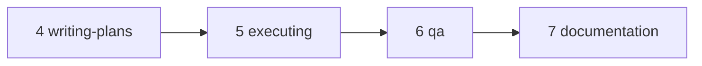
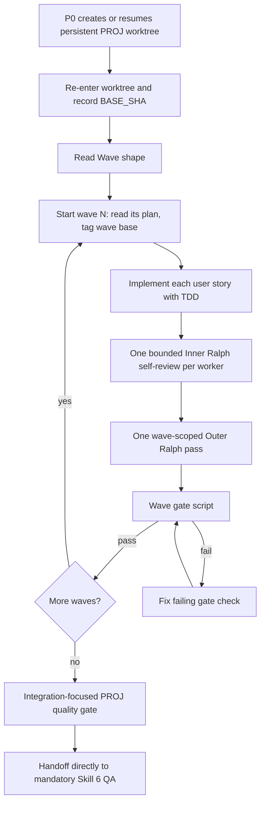
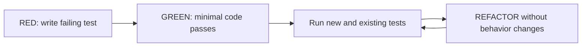

# Executing Skill

**Last updated:** 2026-09-08

The executing skill is Step 5 in the 0-to-8 chain. It turns the wave plans from Step 4 into working code, one PROJ at a time, with deterministic verification once per wave and hard gates between waves.

Its main job is orchestration. When delegation is available, workers own every code, test, and fix edit. The lead owns decomposition, dispatch, integration, deterministic verification, gates, commits, and operational records. Disjoint work runs concurrently; dependencies and overlapping ownership run serially. Local editing is only a visible fallback when delegation is unavailable or prohibited.

## Where It Fits


```mermaid
flowchart LR
  S4[4 writing-plans] --> S5[5 executing]
  S5 --> S6[6 qa]
  S6 --> S7[7 documentation]
```

Inputs:

- Wave shape in `specs/PROJ-<X>-<theme>/architecture-delta.md` (read at PROJ start)
- Wave plans in `specs/PROJ-<X>-<theme>/3-4_plan/PROJ-<X>-wave-<N>-plan.md` (one per wave, read at that wave's start)
- PRDs in `specs/PROJ-<X>-<theme>/2_PRDs/*.md` (authoritative; opened only when a plan/PRD AC conflict is suspected)
- Architecture in `specs/PROJ-<X>-<theme>/3-4_plan/PROJ-<X>-architecture.md` (on demand; workers get `architecture-delta.md` through their context bundle)
- Gate config in `specs/PROJ-<X>-<theme>/3-4_plan/wave-gate-config.json`
- UI handoff in `specs/PROJ-<X>-<theme>/1d_prototypes/implementation-handoff.md`, when the PROJ has UI work

Outputs:

- Implemented and committed code
- `specs/PROJ-<X>-<theme>/5_progress/PROJ-<X>-progress.md`
- Optional source-local `agent.md` notes for non-obvious gotchas
- A QA-ready PROJ handoff to Step 6

## Core Lifecycle


```mermaid
flowchart TD
  A[P0 creates or resumes persistent PROJ worktree] --> B[Re-enter worktree and record BASE_SHA]
  B --> C[Read Wave shape]
  C --> D[Start wave N: read its plan, tag wave base]
  D --> E[Implement each user story with TDD]
  E --> F[One bounded Inner Ralph self-review per worker]
  F --> G[One wave-scoped Outer Ralph pass]
  G --> H[Wave gate script]
  H -->|pass| I{More waves?}
  H -->|fail| J[Fix failing gate check]
  J --> H
  I -->|yes| D
  I -->|no| K[Integration-focused PROJ quality gate]
  K --> M[Handoff directly to mandatory Skill 6 QA]
```

The loop is intentionally continuous. A green wave gate is the signal to start the next wave; the lead does not stop for user confirmation between waves unless there is a blocker.

## Preflight

Before implementation starts, the skill checks the project environment because later gates depend on specific tools and config.

Required setup includes:

- A clean, committed control checkout at the approved CP1 HEAD.
- A registered persistent sibling worktree on `proj/PROJ-X`; P5–P8 execute there.
- Worktree-local dependencies installed reproducibly from the detected lockfile.
- An ignored `.env.local` source symlinked from the control checkout. Development
  data and hosted-auth budgets remain shared and use the configured common lock.
- CodeRabbit config at `.coderabbit.yaml` or `.coderabbit.yml`, with focused path filters.
- Supabase CLI or equivalent Supabase tooling when the project uses Supabase.
  On a Supabase project, every wave gate also re-checks that the shared local
  DB's applied migrations still match this worktree's own
  `supabase/migrations/` (`migration-drift-check.sh`) — the common lock excludes
  concurrent conflicting operations but does not prevent one worktree advancing
  the schema before a sibling worktree next uses it.
- Playwright MCP when planned frontend routes require full QA later.
- `agent-browser`, `coderabbit`, and `jq` CLIs for wave gates.
- `BASE_SHA`, recorded with `git rev-parse HEAD`.
- `5_progress/PROJ-<X>-progress.md`, created before implementation changes.

`progress.md` is the short-term memory and proof log for the whole PROJ. If it is missing, execution stops and creates it before continuing.

## Memory Files

### `progress.md`

`progress.md` tracks the active wave, user-story task status, tests, acceptance-criteria evidence, recovery stages, gate results, and blockers.

It is updated after every meaningful action:

- After each TDD task cycle.
- After each bounded Inner Ralph result and each wave-scoped Outer Ralph recovery stage.
- After wave gates.
- After quality-gate checks.
- Whenever a blocker appears.

The most important proof blocks are the wave gate blocks:

```markdown
### Wave N Gate - PASSED
```

Those blocks are appended by `scripts/wave-gate.sh`. Manual checklist edits are not enough to prove a wave is complete.

### `agent.md`

`agent.md` is long-term developer memory for non-obvious project gotchas. It lives near the feature source, such as `src/features/<feature>/agent.md`.

Use it sparingly. Good entries describe project-wide behavior that future implementers would otherwise rediscover, such as framework quirks, tooling traps, or dead ends.

## Wave Execution

Each PROJ is split into numbered waves by Step 4. Each wave contains one or more user stories. One story is one worker; the lead splits a story only when its plan header declares `Split: contract` (backend and frontend workers against `api-contracts.md`) or `Split: fan-out` (same-shaped units over disjoint files). An oversized story without such a marker is a planning defect for Step 4, not a runtime decision.

This page describes the full-procedure `5_executing`. The chain's default Step 5 is `5b_executing-large-model`, with the same inputs, outputs, and gates and less procedure; `5_executing` remains the choice for weaker writer models. See [skill-chain.md](skill-chain.md#step-roles).

Before a wave starts:

1. Read relevant `agent.md` notes.
2. Verify the previous wave has a passed gate block, if this is not wave 1.
3. Tag the current HEAD as the wave base:

```bash
git tag "wave-${WAVE}-start-PROJ-${PROJ}"
```

The wave base tag scopes the CodeRabbit review inside the wave gate. Without the tag or `WAVE_BASE_SHA`, the gate fails.

For implementation, the skill chooses the implementer type by scope:

- UI-only user story -> frontend implementer.
- Server-only user story -> backend implementer.
- Full-stack user story -> generic implementer.

Each worker's spawn prompt embeds its story section of the wave plan verbatim, printed by `scripts/story-slice.mjs <wave-plan> <US-ID>`; the lead adds only what the slice lacks (execution mode, ownership and lock rules, a prior-wave summary from `progress.md`, `agent.md` and UI-handoff pointers).

Parallel waves can run multiple independent user stories at once. In those cases, an integration guard monitors file ownership and overlap. Single-story waves do not need team overhead.

The lead asks an active worker for status before considering cancellation; quiet files or a single process snapshot do not establish a hang. Replacement requires a confirmed stop, released child commands/resources, and an explicit transfer of files and partial work. Never message a retired worker or send its replacement to negotiate ownership: messages can resume stopped Claude teammates. The lead owns the handover.

`worktree.sh with-shared-lock -- <command>` is exclusive by default across worktrees. Independently verified fixture lifecycles may opt into `--shared --timeout 30` on the same lock file; migrations, resets, global writes and overlapping fixtures remain exclusive. Shared mode provides a schema barrier, not data or auth-budget isolation. Existing auth-consuming gate commands keep their exclusive outer lock; the gate does not automatically parallelize DB/browser checks. Trace nested acquisitions before wrapping a test runner, since forked workers may drop inherited fd 8 and wait on their own parent.

Lock timeout is infrastructure failure (exit 73), with `SKILLCHAIN_LOCK_WAIT` and `SKILLCHAIN_LOCK_TIMEOUT` diagnostics. Keep its wait budget below an outer wrapper's timeout and preserve the failure classification. PID snapshots and process age do not prove lock age or abandonment. Every browser probe must close its owned session on error as well as success. See the [worker lifecycle and resource guide](../claude/skills/5_executing/references/worker-lifecycle.md) for scheduling, fixture isolation, diagnostics and incremental migration.

## TDD Task Loop

Each user-story implementation follows a task-level TDD loop:


```mermaid
flowchart LR
  R[RED: write failing test] --> G[GREEN: minimal code passes]
  G --> T[Run new and existing tests]
  T --> RF[REFACTOR without behavior changes]
  RF --> T
```

Rules:

- No production code before a failing test.
- The failing test must fail for the expected reason, not because of import or setup errors.
- After the fix, run the relevant tests and existing regression tests.
- Refactors must not add behavior.
- The implementer must report actual commands and observed results.

## Inner Ralph Self-Review

After all tasks for a user story are implemented, its worker runs one bounded self-review covering task/spec compliance, error handling, type safety, test quality, boundaries, and architecture. The worker fixes confirmed issues once, reruns targeted tests, and reports unresolved issues without starting another self-review cycle.

The implementer does not verify acceptance criteria. That is reserved for the lead's wave-scoped Outer Ralph pass.

## Wave-Scoped Outer Ralph

Before the AC pass, complete the same closure checklist in parallel and sequential modes:

1. Match every story's `Smoke Test` route and behavior to gate smoke or current-wave authenticated scenario coverage.
2. Assign missing scenarios to the named browser owner after conflicting DB work releases resources; an existing story worker can own them.
3. Integrate and commit scenario files, command/route mappings and any selection-only hook. Prefer files per wave or cohesive feature; a route load alone does not prove an interaction.

After every worker returns and this coverage is committed, the lead starts the canonical wave acceptance checks with:

```bash
bash scripts/wave-gate.sh --ac-only <N> <X> <theme>
```

This AC-only pass uses the gate's timeout, auth-budget, pacing, and rate-limit controls and writes its results directly to `ralph-wave-<N>.json`. It collects every ordinary AC failure so disjoint repairs can be batched, while infrastructure and auth-budget exhaustion still fail fast. It exits before regressions, build, CodeRabbit, browser smoke, component registry, progress certification, and next-wave tagging.

Evidence binds each canonical AC ID, task, exact command, test files, selected-test count, and committed `HEAD`. Successful commands with matching test files, auth context, HEAD and complete gate-config hash share execution across AC IDs, retaining a record for each ID. Failed, empty-selection and timed-out commands share their result only within the current pass; the next recovery pass retries them. Cross-HEAD reuse is not supported; clear Ralph evidence after dependency/runtime/environment changes.

An AC awaiting an authorized external prerequisite retains its original command and test files and declares `external_dependency` with `reason`, `decided_by`, `decided_at` and `check_command`. The read-only readiness check runs before cache lookup: exit 0 runs the original AC fresh, exit 76 records `blocked_external` and continues checking other ACs, and any other nonzero result is infrastructure failure (gate exit 74). With no ordinary failure, an externally blocked pass exits 76 without certifying the wave or unlocking the next wave; ordinary failures still fail the pass. This is neither acceptance nor a Sonar-style waiver. Keep the authorized decision in `decisions.md`; PR, stop and morning report renderers surface the declared prerequisites. Continuing independent work requires explicit dependency replanning. See [planning contracts and migration](../claude/skills/4_writing-plans/references/wave-gate-config.md).

Recovery has exactly four stages:

1. Normal fix round 1, clustered by disjoint ownership.
2. Normal fix round 2 with fresh workers.
3. Fresh diagnosis without edits.
4. A different implementer applies the diagnosis.

After each edit is committed, the lead reruns the same `--ac-only` command. The new `HEAD` conservatively invalidates all earlier AC passes. If failures remain after stage four, or diagnosis finds an invalid or contradictory AC, execution uses the existing blocked-run evidence path. It does not loop indefinitely or weaken the AC.

## Wave Gate

The wave gate is the hard boundary between waves.

```bash
bash scripts/wave-gate.sh <N> <PROJ-X> <theme>
```

The script is the hard boundary and validates:

- Phase 0 runs each declared regression `selection_check_cmd` before AC verification. It must select the same scenarios without browser/DB/auth effects and emit a supported positive count, such as `Running 3 tests`. Declared test files above 800 lines produce an advisory warning, not a failure or automatic split.
- Every structured `ac_commands` entry for the wave exits 0 and selects tests.
- A cached AC pass matches its command, test files, auth context, configuration hash, positive selected count, and committed `verified_head`.
- Every declared `regression_commands` entry passes before build; selection-aware suites cannot pass empty. Only entries with `reuse_passed: true` can reuse deterministic, non-auth local results on unchanged HEAD/configuration; external or auth-dependent tests run live.
- The configured `build_cmd` exits 0.
- CodeRabbit archives unique raw and normalized evidence for every attempt,
  ingests validated finding records, and leaves no cumulative open blocking ledger findings.
- The gate reuses or starts the configured dev server. Anonymous routes retain
  the expected URL and text; redirects fail. Protected routes use auth state or
  are covered by current-wave authenticated AC or regression evidence. Browser operations have bounded timeouts.
- `gen-component-registry.mjs --check` passes: `docs/components.md` is current, every component carries its doc block, and every component has its `id="<kebab-name>"` section on the showcase page.

After ACs, regressions, browser smoke and the component registry check pass, build and CodeRabbit run concurrently on the same committed HEAD as the last gate phase, so an environmental smoke failure costs no review. Their logs and results remain separate; both must finish successfully before certification. Interruption stops their process groups. Database and browser checks remain sequential. Any committed or non-evidence uncommitted change prevents Ralph reuse.

Plan regressions around shared behavior affected by the wave. Broad hosted-auth/browser suites belong in the declared quality/CI/nightly phase; do not mechanically replay the entire growing suite at every wave.

If the script exits non-zero, execution stops at that gate. A missing external
prerequisite (exit 76) waits for readiness; lock contention (exit 73) requires
resource diagnosis, not assertion changes. Actual code corrections go to a
follow-up worker before rerunning the gate. Only a passing script allows the
next wave to start.

On success, the script appends the canonical passed block to `progress.md`.
That proof means current ACs plus the declared regression suite passed;
it does not imply that all earlier waves' AC commands were rerun.

The current wave gate rejects legacy string AC entries because they lack stable
AC/task/test-file evidence and a mandatory regression suite. Before execution,
reopen the plan in Writing Plans, add the structured metadata, and reapprove it;
the runtime never infers AC identity from an old array index.

## Build Policy

The skill avoids scattered build checks.

- Wave builds run inside `scripts/wave-gate.sh`.
- The PROJ quality gate can reuse the final wave build when declared `build_artifacts`, inputs and command still match; otherwise it runs a fresh build. Code fixes invalidate old proof.

If a build fails, a fix worker gets the verbatim compiler output and the failing gate is rerun.

## CodeRabbit and Smoke Tests

CodeRabbit is mandatory per wave, but it is owned by the wave gate. The lead does not run a second separate per-wave CodeRabbit review. Raw and normalized attempt files are retained, and the decision uses the cumulative open blocking ledger rather than only the latest nondeterministic response.

Frontend smoke tests are also owned by the wave gate. They use `agent-browser` against URL and content expectations; a login redirect is not a successful anonymous smoke result.

## PROJ Quality Gate

After all waves pass, the quality gate checks the assembled feature diff from `BASE_SHA` to `HEAD`.

It focuses on assembled cross-wave risks and does not replay wave ACs. It includes:

- Cross-wave contracts, shared state, authorization boundaries and unresolved wave findings. The reviewer follows affected interfaces and callers instead of repeating the wave review or QA's six-persona panel.
- A verified PROJ build using `build_cmd`, with conservative final-wave artifact reuse.
- Sonar at PROJ end: an initial scan and bounded fix/rescans. If the configured wrapper also generates coverage, split it into `coverage_cmd` plus a scanner-only `sonar_cmd`, retaining the ordinary combined wrapper entry point for other callers. Coverage failures block; uploading partial coverage is not a passing test result.
- Declared `quality` phase tests and lint. CI/nightly commands are checked for workflow wiring, not replayed locally. Wave ACs are not replayed here.

The integration reviewer can run alongside build and coverage when they do not contend for resources. Sonar starts after coverage completes. Keep shared database/browser checks serialized and retain their lock/auth controls. Collect all stream results before dispatching one batch of confirmed fixes. Verify the combined revision once per recovery round; keep the existing per-issue attempt limits and Sonar carry-forward policy.

`quality-evidence.mjs` runs configured commands with timeouts and records their command, commit, input fingerprint, exit result, log hash, selected-test count and artifact hashes under `5_progress/quality-*`. Build/coverage reuse requires declared `build_artifacts`/`coverage_artifacts` and matching inputs and artifacts. The fingerprint includes tracked code/configuration, local environment files, exported environment, Node runtime and dependency-install markers. Evidence-only commits preserve proof; code/configuration changes invalidate it. Clear build/coverage evidence after manual toolchain/dependency changes or changes to external inputs that cannot be fingerprinted.

Run it from the PROJ root after sourcing `scripts/env-local.sh`:

```bash
node scripts/quality-evidence.mjs <X> <theme> run build
node scripts/quality-evidence.mjs <X> <theme> run coverage       # when configured
node scripts/quality-evidence.mjs <X> <theme> run sonar          # after coverage
node scripts/quality-evidence.mjs <X> <theme> run 'test:<label>'  # each quality entry
node scripts/quality-evidence.mjs <X> <theme> run lint
node scripts/quality-evidence.mjs <X> <theme> review <report-path>
bash scripts/quality-gate-proof.sh <X> <theme>
```

Record a review only after its P0/P1 findings are resolved. For an allowed Sonar skip, use `... skip-sonar 'sonar CLI unavailable'` or `... skip-sonar 'project not configured'`. The proof script requires both the human-readable gate statuses and valid evidence for current inputs. Sonar submission requires a fresh task receipt; the Sonar reviewer still checks the server's completed analysis and records its disposition.

Exit criteria:

- Zero remaining P0/P1 code-review findings.
- Full build passes.
- If Sonar ran, zero BLOCKER/CRITICAL/MAJOR issues, or every remaining one is
  documented as carried-forward after a bounded 3-round fix-and-rescan loop.
  A carried-forward Sonar issue does not block this gate — Sonar's loop never
  escalates or stops the run, unlike every other gate item.
- If Sonar was skipped, the skip reason is logged.
- Declared integration/quality-phase tests pass.
- No new lint errors.

The lead must verify findings before fixing them. Automated review output can be wrong, too broad, or outside scope. Confirmed review and Sonar findings share recovery rounds, with re-review of the combined fix diff. Sonar BLOCKER/CRITICAL/MAJOR issues retain their three-round fix/rescan limit; whatever survives is documented in `progress.md`, not escalated. Lower-severity issues are logged for user decision unless time and scope allow.

## Handoff to Skill 6

Skill 6 is mandatory. Skill 5 performs no duplicate browser E2E, red-team, UI-audit, or other QA stage; it hands the green PROJ Quality Gate directly to Skill 6's comprehensive QA and fix controller.

Before handoff, the lead verifies that `progress.md` contains:

- Wave plans and wave-scoped Ralph evidence/recovery summaries.
- Wave gate proof blocks.
- Quality-gate code review, build, and Sonar results or explicit skip reason.

Skill 6 then runs the comprehensive QA panel, security review, simplicity review, PROJ retrospective, and `AGENTS.md` candidate collection. Skill 7 later uses those artifacts for documentation.

## Failure Handling

Wave AC recovery follows the exact four-stage sequence above. For other repeated failures:

- Reproduce the failure.
- Read the full error and stack trace.
- Form one hypothesis.
- Make the smallest fix.
- Re-run the failing check and relevant regressions.
- Use the existing blocked/escalation path with the exact history when bounded recovery is exhausted.

Escalate when:

- Wave-scoped Outer Ralph exhausts both normal fix rounds, fresh diagnosis, and the diagnosis-driven implementation.
- The root cause is a spec or architecture problem.
- A required dependency or external service is unavailable.
- Requirements are ambiguous or contradictory.

## What Makes the Skill Strict

The executing skill is strict because every transition has proof:

- TDD proves implementation tasks.
- One bounded Inner Ralph self-review covers task-level spec and code review.
- Wave-scoped Outer Ralph proves acceptance criteria against the committed wave result.
- Wave gates prove a wave is safe to build on.
- The quality gate proves the assembled feature.
- Mandatory Skill 6 provides comprehensive QA without a duplicate Step 5 pass.

That structure lets long implementation runs continue without repeatedly asking for permission while still leaving a durable audit trail for QA, documentation, and future agents.
