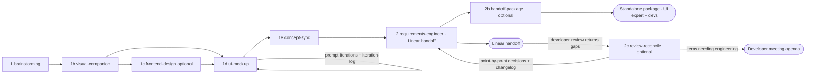

# PM / Product Discovery Chain

A track for pure product management: brainstorm, wireframe, mockup, iterate with stakeholders, reconcile the concept, and hand a PRD to a developer via [Linear](https://linear.app). **No code is written and there is no codebase here.** The same skills as the full chain are reused — only the path through them and the endpoint differ.

## Flow



Steps 3–7 (architecture, plans, executing, QA, documentation) do **not** apply on this track.

## Workspace and folder setup

A discovery engagement has no codebase, so there is nothing to scaffold. Open a working folder (one per client/engagement, or a shared discovery workspace) and let the skills create the structure as they run. The layout is **identical to the full chain** — same `specs/PROJ-<X>-<theme>/` tree — so every skill and `chain-guide` work unchanged:

```text
<your-discovery-folder>/            git optional
└── specs/
    └── PROJ-1-<theme>/
        ├── 0_context/              # brownfield: existing-state.md + references/ (only if something already exists)
        ├── 1_brainstorm/           # PROJ-1-concept.md
        ├── 2_visual-companion/     # layout-decision.md + layout-exploration.html
        ├── 4_design/               # design-language.md (only if a design system is defined)
        ├── 5_mockups/              # mockups + sitemap + implementation-handoff.md + iteration-log.md
        ├── 3_PRDs/                 # PRDs + linear-import.md
        └── 8_handoff/              # optional standalone package runs
```

`brainstorming` (1) bootstraps `specs/PROJ-<X>-<theme>/` on its first run, exactly as in the full chain. Nothing needs to be created by hand.

**Git is optional.** No skill on this track requires a git repository; if the workspace isn't a repo, the commit steps are skipped and the files themselves are the durable artifacts. Because the core value of this track is *tracking mockup iterations and concept changes*, an optional `git init` is recommended for a version history — but never required.

## Steps

| Step | Skill | Purpose on this track |
|---|---|---|
| 1 | brainstorming | Turn stakeholder input and requirements into a first concept; for brownfield, capture the existing state into `0_context/` |
| 1b | visual-companion | Decide the rough UI shape before mockups |
| 1c | frontend-design (optional) | Only when adopting an existing design system; otherwise skip and use greyscale wireframes |
| 1d | ui-mockup | Build mockups, then iterate by prompting changes directly into the HTML; every concept-affecting change is recorded in `iteration-log.md` |
| 1e | concept-sync | After agreement, reconcile the tracked changes back into the concept and set the delivery track |
| 2 | requirements-engineer | Produce PRDs plus a paste-ready `linear-import.md` for the developer |
| 2b | handoff-package (optional) | Assemble a standalone, zippable package for an external UI/UX expert and/or developers; the chain ends here |
| 2c | review-reconcile (optional) | When a developer/stakeholder review returns gaps on the PRDs, resolve them point by point, defer engineering items to a developer meeting, and update PRDs/concept/mockups with a handoff-facing changelog |

## The review-reconcile loop

The Linear/handoff endpoint is rarely one-shot. A developer reviewing the PRDs typically returns a list of gaps, contradictions, and open questions. `review-reconcile` (2c) closes that loop:

- It reads the review and the canonical scope/decisions source, then walks each gap **point by point** — explaining what is flagged and why, framing the options with a recommendation, and deciding with the product owner there and then.
- Items that need engineering input (feasibility, architecture, effort, security, provider constraints) are **not force-decided**; they are deferred onto a `Developer Meeting Agenda` and stay open for the next round.
- Every decided item is recorded before any binding edit, then reconciled across the PRD (binding), concept (if one exists), and mockups (only where they now contradict the PRD; mockup changes are logged in `iteration-log.md`).
- A running, audience-facing `3_PRDs/review-changelog.md` records what changed since the reviewed version, so `handoff-package` can show downstream UI/UX experts and developers the delta without making them read the full internal decision log. Per-round `*-review-decisions.md` files remain the detailed audit trail and are copied into the handoff appendix when present.

It is the post-requirements sibling of `concept-sync`: `concept-sync` reconciles mockup iterations into the concept *before* requirements; `review-reconcile` reconciles review feedback into the PRDs *after* requirements. Skip it when the feedback is pure copyediting (edit the PRD directly) or when it is a fresh mockup iteration (use `ui-mockup` + `concept-sync`).

## Brownfield: capturing what already exists

When the work extends or fits into something that already exists (a live product, a design system, a brand, established vocabulary), there is no codebase to scan — so `brainstorming` captures the as-is state explicitly into `specs/PROJ-<X>-<theme>/0_context/`:

- `existing-state.md` — existing surfaces, design system/brand, domain vocabulary, and invariants that must be preserved.
- `references/` — screenshots, exported style guides, and saved links the user provides. A provided live URL may be fetched for reference.

This becomes the design source where config files would normally be: `visual-companion` grounds layout exploration in the existing shell, `ui-mockup` adopts the captured tokens/components in **design-system mode**, and `handoff-package` folds the as-is starting point into the standalone package. Skip it for greenfield (nothing exists yet).

## Fidelity: greyscale vs. design system

- **Greenfield, no design system:** `ui-mockup` uses **greyscale wireframes** with very small border radii — structure and flow, not visual identity. A UI/UX expert refines the visual design downstream. Skip `frontend-design`.
- **Existing design system:** `ui-mockup` adopts the existing tokens, colors, typography, and radii (from `0_context/existing-state.md` on this track) so mockups read as the real product.

## The iteration loop

Stakeholder agreement is reached *on the mockups*. Because changes are prompted directly into the HTML, they would otherwise be lost. `ui-mockup` therefore maintains `5_mockups/iteration-log.md`, one entry per round, each classified as scope, behavior, or presentation-only. Only scope/behavior changes flow back into the concept.

`concept-sync` (1e) then reads the log, updates `1_brainstorm/PROJ-<X>-concept.md`, records superseded decisions, and writes a `Handoff Readiness` section with `Delivery track: discovery (Linear handoff)`. This closes the loop so requirements are written against an accurate concept.

## Linear handoff

In Linear handoff mode, `requirements-engineer` writes normal PRDs (user stories, acceptance criteria, edge cases) but omits in-repo implementation detail and adds `3_PRDs/linear-import.md`, structured so each PRD becomes a Linear issue and each user story a checklist item. Export the mockups (HTML → images or PDF) and attach them to the issues. The developer who picks up the work owns architecture and implementation.

## Standalone handoff package

When the work goes to people outside the repo — an external UI/UX expert (e.g. a Figma assignment) and/or a separate dev team — `handoff-package` (2b) assembles a single self-contained dated run folder under `8_handoff/` that survives being zipped and shared. Every run gets its own folder, for example `8_handoff/YYYY-MM-DD-handoff/`; repeated runs on the same day append `-02`, `-03`, and so on:

- `README.md` — index, reading order, source of truth, and conflict rules (PRD wins over mockup).
- `01-product-brief.md` — product framing without prototype bias.
- `02-scope-and-decisions.md` — the **single source of truth**: vocabulary, invariant rules, scope matrix, and a resolved/open decisions register. Open questions include owner, downstream impact, and next decision point. Every other file references it instead of restating it.
- `03-requirements/` — the binding PRDs, copied in.
- `04-ui-handoff.md` — for the UI/UX expert: personas, screen families, workflow contracts, and **red lines vs. design latitude** (what must not drift vs. what the expert owns).
- `05-developer-handoff.md` — for developers: functional domain rules, server-enforced invariants, and an explicit out-of-scope list.
- `06-mockups/` — a standalone copy of the mockups, design language, sitemap, and iteration log (reference only).
- `07-review-changelog.md` — when `review-reconcile` (2c) has run: the audience-facing record of what changed across review rounds, so downstream readers see the delta since the version they reviewed.
- `08-review-decisions/` — when per-round `*-review-decisions.md` files exist: detailed rationale and follow-up audit trail, included as an appendix rather than primary reading path.
- `linear-import.md` — paste-ready Linear issues when developers are an audience.

Use it for external/standalone handoffs. Skip it when a quick PRD→Linear handoff (`linear-import.md` from Step 2) is enough.

## Detection

`chain-guide` (0) recommends this track when the concept's `Handoff Readiness` is `discovery (Linear handoff)`, when a mockup iteration log exists in a repo with no application code, or when the user states they are doing discovery/PM only.

`chain-guide` recommends `review-reconcile` (2c) when PRDs already exist and the user brings back a developer/stakeholder review of them (gaps, contradictions, open questions), or when a `*-review-decisions.md` record exists with open items.
