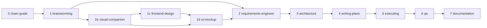

# Skill Chain

## Flow

`refactor-dreamer` and `sonar-cli` intentionally sit outside this flow. Launch `refactor-dreamer` separately for a long-form architecture drift/refactor discovery run, then feed its `chain-input.md` into the appropriate chain step. Use `sonar-cli` separately for SonarScanner/SonarQube CLI setup, analysis runs, and issue triage.

## Decomposed Ideas

Step 1 can split a broad seed into several PROJs before detailed intake. This is for product boundaries, not task management: PRDs split behavior inside one PROJ, and waves split implementation order.

After decomposition:

- Each PROJ gets its own concept, PRDs, architecture, plans, execution, QA, and docs.
- Downstream skills work one PROJ at a time and treat sibling PROJs as dependencies, context, or future scope.
- `frontend-design` may be shared across tightly linked UI PROJs through one canonical `4_design/design-language.md` with an `Applies To` section.
- `visual-companion` and `ui-mockup` stay scoped to the current PROJ unless the user explicitly requests a combined UI review.

## Step Roles

| Step | Skill | Purpose |
|---|---|---|
| 0 | chain-guide | Detect current PROJ state and recommend the next step |
| 1 | brainstorming | Turn an idea into a buildable feature concept |
| 1b | visual-companion | Explore UI structure before requirements |
| 1c | frontend-design | Define visual language for greenfield or hybrid UI work |
| 1d | ui-mockup | Create lightweight mockups and implementation handoff |
| 2 | requirements-engineer | Write PRDs, user stories, acceptance criteria, and edge cases |
| 3 | architecture | Produce PM-friendly technical architecture |
| 4 | writing-plans | Split work into wave-based implementation plans |
| 5 | executing | Implement waves with TDD and quality gates |
| 6 | qa | Run E2E QA, security, persona review, and simplicity review |
| 7 | documentation | Curate feature and technical docs, then merge approved AGENTS.md candidates |

For a detailed explanation of Step 5 loops, gates, proof files, and QA handoff, see [Executing Skill](executing-skill.md).

## Optional Skills

| Skill | Purpose |
|---|---|
| refactor-dreamer | Run an overnight/deep codebase scan for architecture drift, larger refactor opportunities, ADR candidates, fitness functions, and chain-ready input |
| sonar-cli | Set up and operate SonarScanner CLI and SonarQube CLI for project analysis, quality gates, and issue triage |
