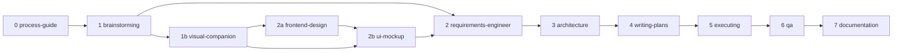

# Skill Chain

## Flow

`refactor-dreamer` intentionally sits outside this flow. Launch it separately for a long-form architecture drift/refactor discovery run, then feed its `chain-input.md` into the appropriate chain step.

## Step Roles

| Step | Skill | Purpose |
|---|---|---|
| 0 | process-guide | Detect current PROJ state and recommend the next step |
| 1 | brainstorming | Turn an idea into a buildable feature concept |
| 1b | visual-companion | Explore UI structure before requirements |
| 2a | frontend-design | Define visual language for greenfield or hybrid UI work |
| 2b | ui-mockup | Create lightweight mockups and implementation handoff |
| 2 | requirements-engineer | Write PRDs, user stories, acceptance criteria, and edge cases |
| 3 | architecture | Produce PM-friendly technical architecture |
| 4 | writing-plans | Split work into wave-based implementation plans |
| 5 | executing | Implement waves with TDD and quality gates |
| 6 | qa | Run E2E QA, security, persona review, and simplicity review |
| 7 | documentation | Curate feature and technical docs, then merge approved AGENTS.md candidates |

## Optional Skills

| Skill | Purpose |
|---|---|
| refactor-dreamer | Run an overnight/deep codebase scan for architecture drift, larger refactor opportunities, ADR candidates, fitness functions, and chain-ready input |
