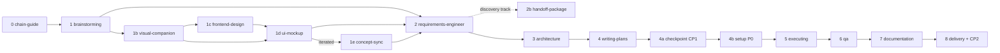

# Skill Chain

## Flow

```mermaid
flowchart LR
  S0[0 chain-guide] --> S1[1 brainstorming]
  S1 --> S1B[1b visual-companion]
  S1 --> S2[2 requirements-engineer]
  S1B --> S1C[1c frontend-design]
  S1C --> S1D[1d ui-mockup]
  S1B --> S1D
  S1D -->|iterated| S1E[1e concept-sync]
  S1D --> S2
  S1E --> S2
  S2 -.discovery track.-> S2B[2b handoff-package]
  S2 --> S3[3 architecture]
  S3 --> S4[4 writing-plans]
  S4 --> S4A[4a checkpoint CP1]
  S4A --> S4B[4b setup P0]
  S4B --> S5[5 executing]
  S5 --> S6[6 qa]
  S6 --> S7[7 documentation]
  S7 --> S8[8 delivery + CP2]
```

The chain serves two delivery tracks: the full in-repo build (Steps 1–7) and a **product discovery** track that stops at Step 2 and hands a PRD to a developer via Linear. See [PM / Product Discovery Chain](pm-chain.md).

`refactor-dreamer` and `sonar-cli` intentionally sit outside this flow. Launch `refactor-dreamer` separately for a long-form architecture drift/refactor discovery run, then feed its `chain-input.md` into the appropriate chain step. Use `sonar-cli` separately for SonarScanner/SonarQube CLI setup, analysis runs, and issue triage.

## Decomposed Ideas

Step 1 can split a broad seed into several PROJs before detailed intake. This is for product boundaries, not task management: PRDs split behavior inside one PROJ, and waves split implementation order.

After decomposition:

- Each PROJ gets its own concept, PRDs, architecture, plans, execution, QA, and docs.
- Downstream skills work one PROJ at a time and treat sibling PROJs as dependencies, context, or future scope.
- `frontend-design` may be shared across tightly linked UI PROJs through one canonical `4_design/design-language.md` with an `Applies To` section.
- `visual-companion` and `ui-mockup` stay scoped to the current PROJ unless the user explicitly requests a combined UI review.

## Step Roles

| Step | Skill | Purpose |
|---|---|---|
| 0 | chain-guide | Detect current PROJ state and recommend the next step |
| 1 | brainstorming | Turn an idea into a buildable feature concept |
| 1b | visual-companion | Explore UI structure before requirements |
| 1c | frontend-design | Define visual language for greenfield or hybrid UI work |
| 1d | ui-mockup | Create lightweight mockups and implementation handoff; track stakeholder iterations |
| 1e | concept-sync | Reconcile iterated mockup changes back into the concept; set delivery track |
| 2 | requirements-engineer | Write PRDs, user stories, acceptance criteria, and edge cases; Linear handoff mode for discovery |
| 2b | handoff-package | Assemble a standalone, zippable handoff package for external UI/UX experts and developers (discovery track) |
| 3 | architecture | Produce PM-friendly technical architecture |
| 4 | writing-plans | Split work into wave-based implementation plans |
| 4a | checkpoint | Checkpoint 1 as a structured reconcile loop: decision log, cascaded plan updates, seal `CP1:approved` in state.json; the same loop serves CP2 PR comments via delivery |
| 4b | setup | P0 once per PROJ: branch + BASE_SHA, tool/auth preflight (codex degradable), framework scripts copied into the repo |
| 5 | executing | Implement waves with TDD and quality gates |
| 6 | qa | Run E2E QA, security, persona review, and simplicity review; strictly read-only finder in framework runs |
| 7 | documentation | Curate feature and technical docs, then merge approved AGENTS.md candidates |
| 8 | delivery | Conflict probe against main, PR with a body rendered from state.json + findings.json, bounded CI fix loop, Checkpoint 2 comment reconcile |

## Framework Runs (Agent Workflow, Stage 1)

After `checkpoint` (4a) seals Checkpoint 1, the host-neutral phase runner
(`runner/run-phase.sh auto <X> <theme>`) drives P0 → P5 → P6 → P7 → P8
unattended — dual Claude + Codex lanes with a single writer per phase,
`state.json`/`findings.json` as the only handoff, stop policy with rescue
branch + stop report, and a rendered morning report at run end. If the
`codex` CLI is missing or unauthenticated, the run degrades to
single-provider with a model-opposite review lane — flagged in the
morning report and PR body, never silent. See [runner/README.md](../runner/README.md)
and CONCEPT.md for the full model.

For a detailed explanation of Step 5 loops, gates, proof files, and QA handoff, see [Executing Skill](executing-skill.md).

## Optional Skills

| Skill | Purpose |
|---|---|
| refactor-dreamer | Run an overnight/deep codebase scan for architecture drift, larger refactor opportunities, ADR candidates, fitness functions, and chain-ready input |
| sonar-cli | Set up and operate SonarScanner CLI and SonarQube CLI for project analysis, quality gates, and issue triage |
