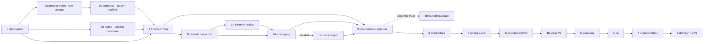

# Skill Chain

## Flow

```mermaid
flowchart LR
  S0[0 chain-guide] --> S0A[0a product-vision · new product]
  S0 --> S0B[0b intake · existing codebase]
  S0A --> S0C[0c bootstrap · stack + scaffold]
  S0C --> S1[1 brainstorming]
  S0B --> S1
  S0 --> S1
  S1 --> S1B[1b visual-companion]
  S1 --> S2[2 requirements-engineer]
  S1B --> S1C[1c frontend-design]
  S1C --> S1D[1d prototyping]
  S1B --> S1D
  S1D -->|iterated| S1E[1e concept-sync]
  S1D --> S2
  S1E --> S2
  S2 -.discovery track.-> S2B[2b handoff-package]
  S2 --> S3[3 architecture]
  S3 --> S4[4 writing-plans]
  S4 --> S4A[4a checkpoint CP1]
  S4A --> S4B[4b setup P0]
  S4B --> S5[5 executing]
  S5 --> S6[6 qa]
  S6 --> S7[7 documentation]
  S7 --> S8[8 delivery + CP2]
```

**Before the first PROJ, once.** A new product runs `product-vision` (0a) —
`docs/PRODUCT.md` plus the numbered PROJ map in `specs/product-roadmap.md` —
then `bootstrap` (0c), which decides the stack into `docs/ARCHITECTURE.md`
§ Stack, runs the real scaffold, and writes root `AGENTS.md` + the
`CLAUDE.md` pointer. An existing codebase runs `intake` (0b) instead, which
reaches the same curated baseline by extraction. Run one path, not both;
the discovery track skips 0c because there is no codebase.

The chain serves two delivery tracks: the full in-repo build (Steps 1–7) and a **product discovery** track that stops at Step 2 and hands a PRD to a developer via Linear. See [PM / Product Discovery Chain](pm-chain.md).

Architecture (3) continues into writing-plans (4) and writing-plans into checkpoint (4a) without intermediate approval stops when their cross-reviews are clean; Checkpoint 1 is the single human approval of the planning package and cascades changes back into both. Either skill still stops on remaining Critical/High findings, open product decisions, or an explicit request to review one artifact alone. If planning exposes a PRD or architecture defect, it returns to the owning skill and its required cross-review before continuing to checkpoint.

`cross-review`, `5b_executing-large-model`, `bugfixing`, `refactor-dreamer`, `sonar-cli` and `vibecoder` intentionally sit outside this flow. `5b_executing-large-model` is not a step of its own but a lean substitute for Step 5 on frontier models: identical gates and state contracts, procedure reduced to invariants. `cross-review` is a mechanism, not a step — it is invoked by producing skills and never routed to directly, which is why it carries no chain number. Concept, architecture, and plan reviews start automatically as soon as their outputs are saved, before user approval or handoff. Requirements, P6 QA, and P7 documentation also require it. Use `bugfixing` for a reported defect that needs reproduction, a narrow repair, regression-test proof, and test-escape analysis without starting a feature PROJ. Launch `refactor-dreamer` separately for a long-form architecture drift/refactor discovery run, then feed its `chain-input.md` into the appropriate chain step. Use `sonar-cli` separately for SonarScanner/SonarQube CLI setup, analysis runs, and issue triage. Use `vibecoder` for a freeform exploratory coding session on a scratch branch: it keeps a live journal while you experiment, then distills it into a `chain-input.md` that feeds `1_brainstorming` as raw input.

## Legacy PROJ Folders

PROJ folders created before the layout rename use the old subfolder names
(`2_visual-companion/` → `1b_visual-companion/`, `4_design/` → `1c_design/`,
`5_mockups/`, `1d_prototypes/` → `1d_prototypes/`, `3_PRDs/` → `2_PRDs/`, `8_handoff/` →
`2b_handoff/`, `6_plan/` → `3-4_plan/`, `7_progress/` → `5_progress/`).
Every skill reads the legacy name when the current one is missing, keeps
writing where the files already are, and offers the rename once. Nothing
blocks on it — a `git mv` per folder plus a path search inside the PROJ's
own documents is the whole migration, and skipping it is a valid answer.

## Decomposed Ideas

Step 1 clarifies the problem before comparing solution directions. If a usable clarification artifact is supplied, `brainstorming` reads it and skips the questions it answers. The concept records its source and carries the problem, success factors, non-goals, and constraints forward. No separate brief file or gate record is required. After clarification, Step 1 can split a broad seed into several PROJs before detailed concept intake. This is for product boundaries, not task management: PRDs split behavior inside one PROJ, and waves split implementation order.

After decomposition:

- Each PROJ gets its own concept, PRDs, architecture, plans, execution, QA, and docs.
- Downstream skills work one PROJ at a time and treat sibling PROJs as dependencies, context, or future scope.
- `frontend-design` may be shared across tightly linked UI PROJs through one canonical `1c_design/design-language.md` with an `Applies To` section.
- `visual-companion` and `prototyping` stay scoped to the current PROJ unless the user explicitly requests a combined UI review.

## Step Roles

| Step | Skill | Purpose |
|---|---|---|
| 0 | chain-guide | Detect current PROJ state and recommend the next step |
| 0a | product-vision | New product: `docs/PRODUCT.md` (what/who/non-goals) + the numbered PROJ map with dependencies |
| 0b | intake | Existing codebase: bootstrap the curated `docs/` baseline by scan + interview, sealed via the checkpoint bootstrap variant |
| 0c | bootstrap | New build: stack into `docs/ARCHITECTURE.md` § Stack, real scaffold with build/test verified green, root `AGENTS.md` + `CLAUDE.md` pointer |
| 1 | brainstorming | Clarify the problem or use a supplied brief, then compare directions and write a buildable feature concept |
| 1b | visual-companion | Explore UI structure before requirements |
| 1c | frontend-design | Define the design system for greenfield or hybrid UI work: tokens, component catalog, and the `/dev/components` showcase |
| 1d | prototyping | Create component mockups in the PROJ folder using the existing app runtime, or standalone HTML without one; track iterations and runtime details in the handoff |
| 1e | concept-sync | Reconcile iterated mockup changes back into the concept; set delivery track |
| 2 | requirements-engineer | Write PRDs, user stories, acceptance criteria, and edge cases; pass the required opposite-provider review before full-chain or Linear handoff |
| 2b | handoff-package | Assemble a standalone, zippable handoff package for external UI/UX experts and developers (discovery endpoint or requested full-chain export) |
| 2c | review-reconcile | Resolve PRD review gaps point by point; defer engineering items to a developer meeting (discovery endpoint or requested full-chain export) |
| 3 | architecture | Produce PM-friendly technical architecture |
| 4 | writing-plans | Split independently verifiable stories into dependency-ordered waves; use expand–contract for wide migrations |
| 4a | checkpoint | Checkpoint 1 as a structured reconcile loop: decision log, cascaded plan updates, seal `CP1:approved` in state.json; the same loop serves CP2 PR comments via delivery |
| 4b | setup | P0 once per PROJ: persistent PROJ worktree + branch/BASE_SHA, tool/auth preflight, reproducible dependency install, framework helpers synchronized from installed skills with an adaptation-protecting hash manifest |
| 5 | executing | Delegate code/test/fix edits to workers, run TDD plus one wave-scoped Ralph pass and hard wave gates, then an integration-focused PROJ gate and direct Skill 6 handoff |
| 6 | qa | Run E2E QA, security, required six-persona opposite-provider evidence review, and simplicity review; strictly read-only finder in framework runs |
| 7 | documentation | Curate feature and technical docs, then merge approved AGENTS.md candidates |
| 8 | delivery | Conflict probe against main, PR body rendered from state.json + findings.json and declared external prerequisites in wave-gate-config.json, bounded CI fix loop, Checkpoint 2 comment reconcile |

## Framework Runs (Agent Workflow, Stage 1 + Stage 2)

After `checkpoint` (4a) seals Checkpoint 1, the host-neutral phase runner
(`runner/run-phase.sh auto <X> <theme>`) drives P0 → P5 → P6 → P7 → P8
unattended — dual Claude + Codex lanes with a single writer-orchestrator per phase,
`state.json`/`findings.json` as the only handoff, and a stop policy: a failed
writer, timeout, unsealed phase, or red gate parks the run — rescue branch
for uncommitted work, state moved to `blocked` with the exact cause, a
rendered stop report — instead of continuing degraded. A rendered morning
report closes every run. If the `codex` CLI is missing or unauthenticated,
the run degrades to single-provider with a model-opposite review lane —
flagged in the morning report and PR body, never silent. See
[runner/README.md](../runner/README.md) and CONCEPT.md for the full model.

The writer lane owns decomposition, dispatch, integration, deterministic
verification, gates, commits, and operational records. When delegation is
available and permitted, it delegates every covered code, test, fix, and
documentation edit to workers under its authority: disjoint ownership runs in
parallel, dependencies or overlap run serially, and corrections return to a
follow-up worker. Local editing is allowed only as an explicitly reported
unavailable/prohibited fallback; the peer lane remains read-only.

P0 creates or resumes a persistent sibling worktree for `proj/PROJ-X`; the
runner re-enters it before P5 and keeps it through P8. Source and dependencies
are isolated. `.env.local` is an ignored symlink to the control checkout, while
the development database and hosted-auth budget are explicitly shared. P8
removes the worktree only after green final CI, an identical pushed upstream
commit, and a clean tree; otherwise reports retain its path, cleanup reason,
and the safe P8 resume command that reseals before retrying cleanup.

`worktree.sh with-shared-lock` is exclusive by default across worktrees for
commands that acquire it, including auth-consuming gate commands. Proven
independent fixture lifecycles may opt into `--shared` on the same lock file;
migrations, resets and overlapping mutable fixtures remain exclusive. This
preserves migration exclusion without automatically parallelizing the gate or
isolating test data/auth budgets. Neither mode prevents a worktree advancing
the schema before a sibling next uses its older `supabase/migrations/`. For a
project on Supabase, `preflight.sh` (P0) and `wave-gate.sh` (every wave) both
run `migration-drift-check.sh`, hard-failing with the exact drifted migration
version(s) and the `supabase db reset` fix. See the `supabase-local-dev`
skill for the same check outside the chain's P0/wave-gate flow.

Wave plans carry structured AC/test-file mappings, targeted regressions,
auth-budget metadata, and deterministic frontend route expectations. Planning,
Checkpoint 1, and P0 run the same consistency validator. A green wave gate
reuses exact same-HEAD evidence produced by its `--ac-only` pass, then certifies
current ACs plus declared regressions—not every earlier AC command.
Legacy string AC entries are rejected by the current wave gate. Upgrade them to
structured AC metadata in Writing Plans and reapprove before execution; the
runtime does not infer AC identity from an old array position.

Browser scenarios have a named owner and files per wave or cohesive feature;
the execution closure checklist covers every story's smoke behavior in both
sequential and parallel modes. Optional `selection_check_cmd` hooks prove a
positive scenario count in Phase 0 before AC execution; test files over 800
lines produce an advisory warning. An authorized `external_dependency` retains
the AC and test while recording `blocked_external` when its prerequisite is
absent. Exit 76 grants no wave certificate or next-wave permission; rendered
PR, stop and morning reports include the declared prerequisites. See
[Executing Skill](executing-skill.md) for these contracts and worker handover
rules, and [Installation](installation.md) before enabling new fields or shared
mode in an existing project copy.

Stage 2 adds the bootstrap and the full context system:

- **`intake` (0b), once per repo:** scan → provenance-marked drafts of the
  curated docs baseline (PRODUCT, ARCHITECTURE, GUIDELINES, DESIGN-SYSTEM,
  components, security-baseline, test-conventions, root AGENTS.md) →
  developer interview → checkpoint (4a) bootstrap reconcile → sealed
  baseline commit (`intake-seal-check.sh`; no state.json — that is born
  at CP1).
- **Context bundles:** P0 compiles one canonical bundle per role from the
  baseline (`compile-context-bundles.mjs`, per-role token budgets — a
  breach FAILS P0) plus Claude/Codex projections with the same canonical
  hash. Claude subagents get their bundle via the SubagentStart hook
  (`context-injector.mjs`), codex lanes read `bundle-<role>.codex.md`;
  micro-fixer and explore spawns get nothing by design.
- **Ponytail parity:** the minimalism ladder comes from the Ponytail
  plugin on both providers — same version and mode, gated in the P0
  preflight. P0 leaves its matcher unset so generic implementation
  fallbacks receive the same ladder.
- **P7 curation + gates:** `documentation` (7) curates docs/ and
  `src/**/agent.md`, then must pass FORM (`curation-caps.sh`: PRODUCT
  ≤30 non-blank lines, ARCHITECTURE ≤200 lines, agent.md ≤100 lines) and
  TRUTH (`cross-review`: the provider opposite the curation author
  reviews the docs delta against the PROJ diff; Critical/High block the
  phase, up to 3 automatic rounds while findings remain; manual rounds have no limit). The runner re-verifies both gates after the seal.
- **`cross-review`:** symmetric opposite-provider review mechanism
  (Claude-authored → `codex exec`, Codex-authored → authenticated, isolated
  `claude -p` with validated structured output; degraded fallback =
  model-opposite, always flagged). Active call sites:
  required PRD review in Step 2, automatic concept/architecture/plan reviews,
  required P6 QA evidence review, and the P7 docs truth gate. Review prompts
  have a 900,000-byte default embedded-material cap; large diffs use explicit
  pathspecs and name every omitted changed path.
  The Claude adapter reports Claude Code's hard 10 MB stdin ceiling rather
  than truncating review material. The QA gate launches one isolated worker per
  persona: Codex-authored QA fails closed without Claude, while Claude-authored
  QA may fall back loudly to six Claude workers when Codex is unavailable.
- **Integration-focused PROJ gate:** once every wave passes, the PROJ
  quality gate reviews only the assembled cross-wave diff from `BASE_SHA`
  (contracts, shared state, authorization boundaries, unresolved wave
  findings) rather than replaying wave ACs — plus a verified `build_cmd`,
  Sonar once at PROJ end with a bounded 3-round fix/rescan loop, and
  declared quality-phase tests/lint. The reviewer, build and coverage can
  run concurrently where resources allow; Sonar waits for coverage. See
  [Executing Skill](executing-skill.md#proj-quality-gate).
- **Hard gates:** P6 cannot seal with an open Critical/High finding. P7
  cannot seal unless the curated docs pass both FORM (`curation-caps.sh`,
  caps above) and TRUTH (a `cross-review` that actually ran this P7 with
  no blocking findings left). The runner independently re-verifies every
  gate after its seal.
- **Bounded evidence retention:** CodeRabbit's raw output is kept because
  the local gate parses it; CI and Sonar reports stay in their source
  systems, while the PROJ gate retains only command logs and task-receipt
  hashes. `cross-review` persists validated normalized findings, not full
  model responses that may carry sensitive context.

For a detailed explanation of Step 5 loops, gates, proof files, and QA handoff, see [Executing Skill](executing-skill.md).

## Optional Skills

| Skill | Purpose |
|---|---|
| 5b_executing-large-model | Drop-in Step 5 for frontier models: same state.sh, wave tag, wave-gate, Outer Ralph recovery, Quality Gate proof and Skill 6 handoff as `5_executing`, with TDD choreography and persona reviews replaced by intent and invariants (worker tiering by `Complexity` kept, strongest model leads and reviews); needs `5_executing` installed, selected in framework runs via `SKILLCHAIN_P5_SKILL` |
| bugfixing | Reproduce and diagnose one reported defect, prove a regression test red before the fix, dispatch a narrow repair, run at most three Ralph repair attempts, and explain why prior tests missed it; standalone evidence lives in `specs/_bugfixing/BUGFIX-YYYYMMDD-HHMM-<slug>/bugfix-report.md` |
| refactor-dreamer | Run an overnight/deep codebase scan for architecture drift, larger refactor opportunities, ADR candidates, fitness functions, and chain-ready input |
| vibecoder | Freeform exploratory coding on a scratch branch with a live-appended journal, distilled at wrap-up into a `chain-input.md` feature seed for `1_brainstorming` |
| sonar-cli | Set up and operate SonarScanner CLI and SonarQube CLI for project analysis, quality gates, and issue triage |
| supabase-local-dev | Diagnose shared-local-Supabase-DB problems outside the chain's own P0/wave-gate flow: migration drift between git worktrees sharing one Postgres instance (keyed by `config.toml`'s committed `project_id`), RLS/grant surprises from testing as the `postgres` superuser, and `config.toml` vs. deployed truth; same `migration-drift-check.sh` check |

Claude-specific experimental or personal skills are intentionally excluded.
